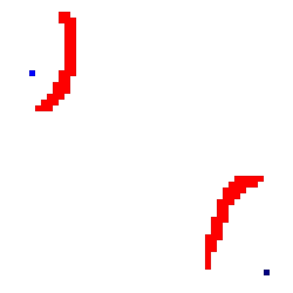

# a_star
A C++ implementation of A\*.
You can choose the heuristics that the algorithm uses by using the C++ policy idiom.

# Polymorphic version
You are on the polymorphic version of this repository. There's also a policy based version of it (branch `policy`).
This project has a sibling project, `a_star_viewer_qt`, which is written in C++/Qt and offers a simple GUI to configure and visualize the algorithm's steps and results. You can find this repository in my github profile.

**Euclidian heuristic.**



**Manhattan heuristic.**


## Available heuristics
- Euclidian
- Manhattan
- Chebyshev
- Octile

## Usage example

### Simple use case - call the algorithm 
```CPP
// 1. Construct the PathFinder and set its heuristic
a_star::PathFinder pathFinder;
auto chosenHeuristic = std::make_unique<a_star::heuristics::EuclidianHeuristic>();
pathFinder.setHeuristic(std::move(chosenHeuristic));

// 2. Set environment data
pathFinder.enableDiagonal();
pathFinder.setMapSize({50, 50});
pathFinder
    .addObstacle({10,20})
    .addObstacles({ {12, 20}, {13, 20} });

// 3. Use the a star algorithm
bool succeeded = pathFinder.findPath({0,0}, {49, 49});
if(succeeded){
    // Do someting with the path
    a_star::PointSet path = pathFinder.getFoundPath();
    for(const auto &point: path) 
        std::cout << static_cast<std::string>(point) << std::endl;
}else{
    std::cout << "Didnt succeed" << std::endl;
}
```

### Execute the algorithm step by step

```CPP
// Step 1 and 2 are the same

// 3.1 init the pathfinder with the "from" and "to" points
if(pathFinder.init({0,0}, {49, 49})){

    //3.2 Call .step method in a while loop until it stops
    while(pathFinder.step()){
        // Do whatever you want between 2 steps
    }

    // 3.3 Do whatever you want with the final result
    if(pathFinder.isSuccessfull()){
        std::cout << "it worked";
    }
}
```
